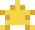

# Welcome to my profile.

### Turning code, data (and coffee) into solutions for global issues

&nbsp;
🌐 <a href="https://starblessed.dev" target="_blank">Portfolio</a>
&nbsp;

&nbsp;
📧 <a href="mailto:dannylo@starblessed.com">Email</a>
&nbsp;

&nbsp;
🐙 <a href="(https://github.com/Starblessed)">Github</a>
&nbsp;

&nbsp;
🔬 <a href="http://lattes.cnpq.br/1351642184089006" target="_blank">Lattes</a>
&nbsp;

---

## My Current Endeavors

## About Me

Passionate scientist with expertise in building **sustainable and impactful machine learning systems**. I specialize in **end-to-end ML infrastructure**, computer vision, and scalable data pipelines, with a commitment to creating AI solutions that are **safe, responsible, and reliable**.

### **Safe**: Won't harm, endanger, or put at risk human freedom, health or integrity.
### **Responsible**: Will commit to a duty be accountable for the results.
### **Realible**: Can be trusted and will sustainably persist in impact.

## 🛠️ Tech Stack

### Machine Learning & Computer Vision

### Backend & Web

### Frontend

### DevOps & MLOps

## 🎯 Goals & Interests

- 🌍 **Impact-driven AI**: Creating solutions for global challenges.
- 🔒 **Responsible AI**: Building safe, auditable, and reliable ML systems.
- 📈 **Scalability**: Production ML infrastructure that serves real-world applications.
- 🔬 **Research**: Computer vision, remote sensing, environmental modeling and social sciences.
- 🌱 **Sustainability**: Systems that are optimized and efficient.
- 🤝 **Society**: Child and Adolescent Safety.

## 🌍 Why I Do This

I believe AI should be a force for good. Coming from an environmental engineering background, I'm committed to building machine learning systems that:
- **Solve real problems** (environmental monitoring, scientific research, social impact)
- **Are responsible** (transparent, auditable, ethical)
- **Actually work** (production-grade, scalable, reliable)

## 🌐 Let's Connect

Would you like to collaborate on a project, feel free to contact me at dannylo@stablessed.dev.

⭐ If you find something interesting, feel free to star it!

---

&nbsp;
&nbsp;
&nbsp;
&nbsp;

&nbsp;
&nbsp;
&nbsp;
&nbsp;

&nbsp;
&nbsp;
&nbsp;
&nbsp;

&nbsp;
&nbsp;
&nbsp;
&nbsp;

&nbsp;
&nbsp;
&nbsp;
&nbsp;

&nbsp;
&nbsp;
&nbsp;
&nbsp;

